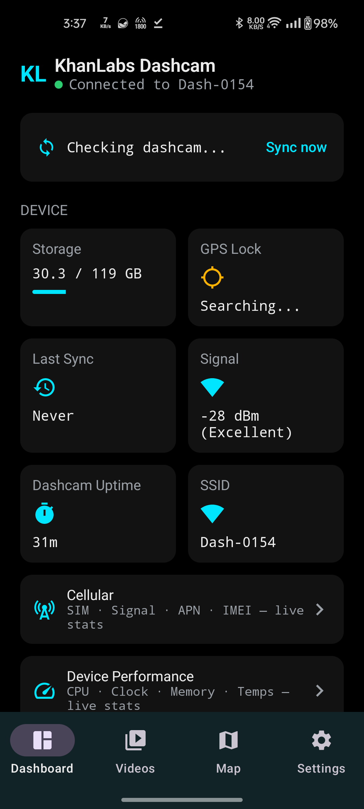
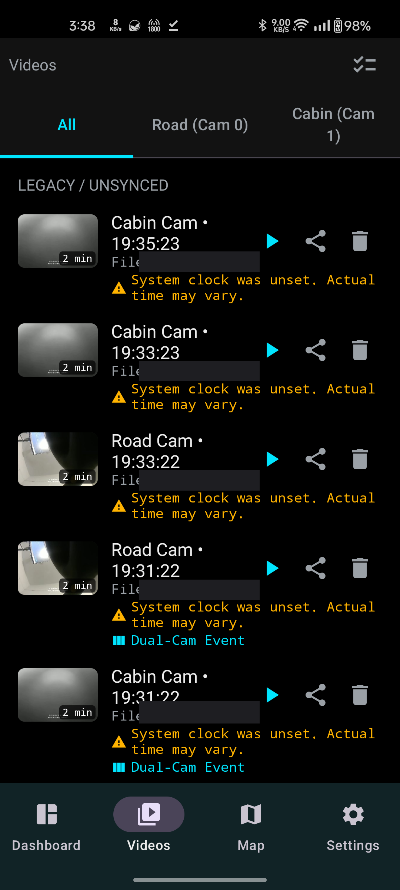
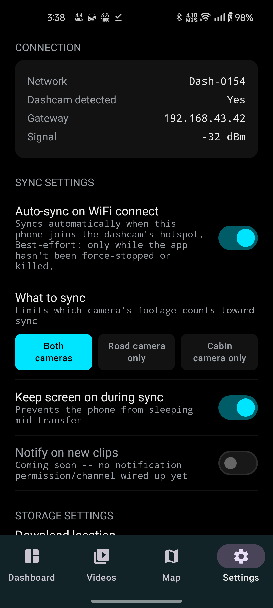
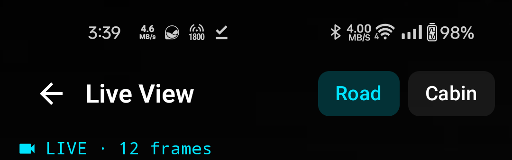
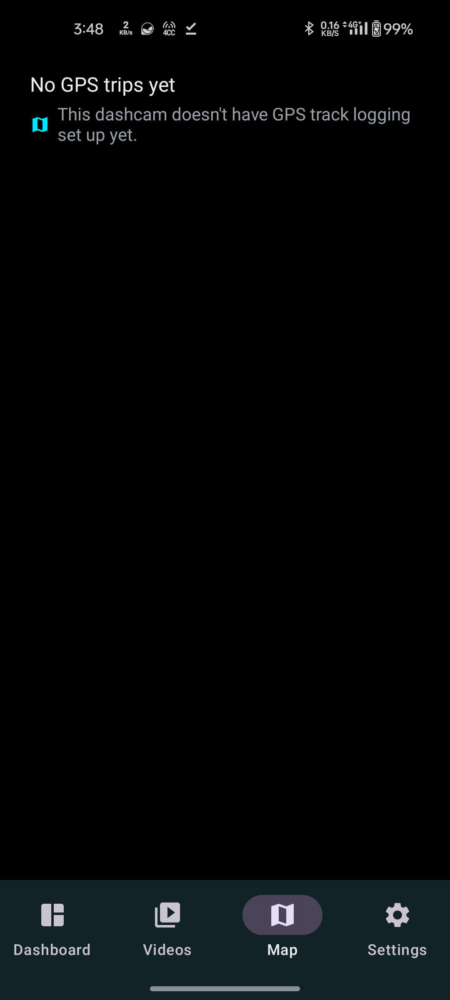

# KhanLabs Dashcam

This is the phone app for my dashcam project. The dashcam itself is a secondhand fleet
unit that I've turned into a private, cloud-free device: no company account, nothing
uploaded anywhere. This app is how I actually use it day to day. It connects to the
dashcam's own WiFi, and lets me browse and download footage, watch a live feed from
either camera, and replay a trip on a map.

Built from scratch, command line only (no Android Studio). A full, dated log of how it
was built and every bug found along the way lives in
[`IMPLEMENTATION_NOTES.md`](IMPLEMENTATION_NOTES.md), if you want the long version.
This README is the short one.

## Screenshots

| Dashboard | Video Gallery |
|---|---|
|  |  |

| Settings | Live View |
|---|---|
|  |  |

| Trip Map |
|---|
|  |

(A couple of identifying details are blurred or cropped out of these: the dashcam's serial
number, and the live camera feed itself, since that could show whatever happened to be in
frame when the screenshot was taken.)

## What it does

- **Dashboard**: one tap to sync new footage, a live connection status, and quick links
  to the other screens (cellular info, device stats, live view, speaker volume).
- **Live View**: real-time video straight from either camera, over the dashcam's own
  WiFi.
- **Video Gallery**: browse, play, share, and delete clips, filtered by camera. Real
  thumbnails, real playback, multi-select for cleaning up in bulk.
- **GPS Trip Map**: see the day's route on a map and replay it, with an option to
  download the map tiles ahead of time so it still works with no internet at all.
- **Settings**: connection info, what to sync, a few toggles, and a debug option to keep
  the dashcam from falling asleep while testing things.

## What you need

The app talks to a Surfsight AI-12 dashcam that has been rooted and is running the
small local file server from the
[surfsight-ai12-reverse-engineering](https://github.com/KhanLabs/surfsight-ai12-reverse-engineering)
project. Without that dashcam, the app still opens, but the screens that need live data
will say they cannot reach it.

## Tech stack

| Concern | Library |
|---|---|
| UI | Jetpack Compose + Material3 |
| DI | Hilt |
| Navigation | Navigation Compose |
| Video playback | Media3 ExoPlayer |
| Maps | OSMDroid (dark map tiles, no API key needed) |
| Networking | OkHttp |
| Async | Kotlin Coroutines / Flow |
| Min/target SDK | 26 / 34 |

## Building

```bash
./gradlew assembleDebug
```

Needs JDK 17 and the Android SDK command-line tools. No Android Studio required, and no
API keys or secrets to set up.

The APK ends up in `app/build/outputs/apk/debug/`. It is debug-signed, so Android will ask
you to allow installing from unknown sources.

## Background

Part of a bigger project turning a secondhand fleet dashcam into something I actually
own and control: rooted, cut off from the manufacturer's cloud, running its own local
file server over its own WiFi hotspot. This repo is just the phone-side app; the
dashcam side is documented in
[surfsight-ai12-reverse-engineering](https://github.com/KhanLabs/surfsight-ai12-reverse-engineering).

## License

MIT. See [LICENSE](LICENSE).
